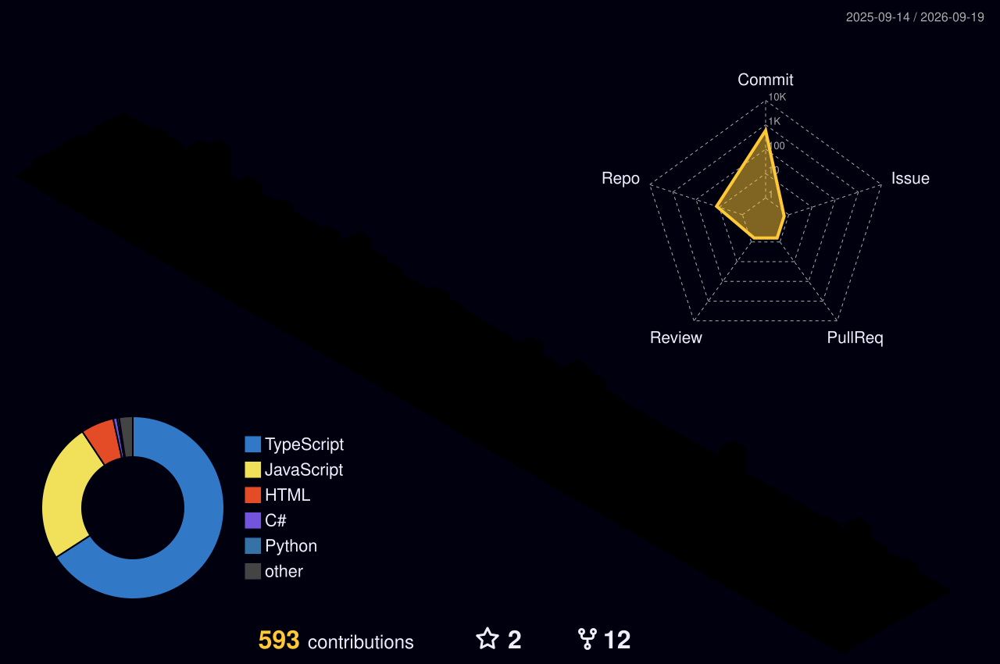

<div align="center">


<br/>

[](https://git.io/typing-svg)

<br/>

<a href="https://bsurajpatra.vercel.app/"></a>
<a href="https://www.linkedin.com/in/b-suraj-patra/"></a>
<a href="https://github.com/bsurajpatra"></a>
<a href="mailto:ankitsuraj1111@gmail.com"></a>
<a href="https://www.instagram.com/suraj_patra_0/"></a>


</div>

<br/>

```yaml
role:          Full Stack Developer · FOSS Advocate
location:      Vijayawada, Andhra Pradesh (from Odisha)
education:     B.Tech CSE, K L E F Deemed University · 2023-2027 · GPA 9.4/10
patents:       2 filed & published
open_source:   9+ repos · Wikipedia, OpenStreetMap, Weblate
competitive:   LeetCode 1700+ · CodeChef 1500+ · Codeforces 1050+
current_offer: TCS Prime — System Engineer (campus recruitment, Jun 2026)
```

<br/>

## Experience

**Open Data Intern** · SwechaAP — *May 2024 – Jun 2024* · Remote
Worked with a non-profit promoting Free and Open-Source Software. Contributed to open-source data analytics and visualization projects, collaborating with developers and researchers to improve data transparency.

<br/>

## Tech Stack

<div align="center">

**Languages**
<br/>


**Frontend**
<br/>


**Backend & Data**
<br/>


**Realtime, ML & Game Dev**
<br/>


**Payments & Tooling**
<br/>


</div>

<br/>

## Projects

<table>
<tr>
<td width="50%" valign="top">

### 🍔 KL Eats
Campus food pre-ordering platform helping students order meals in advance while enabling canteens to manage orders, payments, and settlements efficiently. Live in production.

`Next.js` `Node.js` `MySQL` `Tailwind` `Shadcn UI` `Cashfree` `Redis`

[🌐 Live](https://kleats.in/) · [📁 Repo](https://github.com/KLEats)

</td>
<td width="50%" valign="top">

### 🧠 FaceAttend
Kiosk-grade face recognition attendance platform for institutions — premium Web ERP + real-time mobile app. FaceNet biometric recognition, secure Android kiosk mode, and WebSocket sync prevent proxy attendance, with PDF/CSV analytics reports.

`React Native` `Node.js` `MongoDB` `Python` `Flask` `FaceNet` `Socket.io`

[🌐 Live](https://faceattendai.netlify.app/) · [📁 Repo](https://github.com/bsurajpatra/FaceAttend)

</td>
</tr>
<tr>
<td width="50%" valign="top">

### 🛡️ SafeWebVerify
Full-stack phishing detection platform using machine learning to analyze URLs and classify them as legitimate or phishing in real time.

`React` `Node.js` `Express` `MongoDB` `Flask` `scikit-learn` `JWT`

[🌐 Live](https://safewebverify.netlify.app/) · [📁 Repo](https://github.com/bsurajpatra/SafeWebVerify)

</td>
<td width="50%" valign="top">

### 📌 KarmaSync
Lightweight Agile project management tool for planning, tracking, and collaborating using Kanban boards, sprints, user stories, and daily to-do tracking — all from one dashboard.

`React` `Node.js` `Express` `MongoDB` `JWT` `EmailJS`

[🌐 Live](https://karmasync.vercel.app/) · [📁 Repo](https://github.com/bsurajpatra/KarmaSync_info)

</td>
</tr>
<tr>
<td width="50%" valign="top">

### 🖥️ GitMatch
Production-ready Electron desktop app that assesses candidate fit via a Weighted Job Fit Engine (70%) + Engineering Quality Engine (30%). Supports monorepo scanning, concurrent bulk screening, comparison matrices, and offline PDF exports.

`Electron` `React` `Vite` `Node.js` `PDFKit` `Worker Threads`

[🌐 Live](https://gitmatchx.netlify.app/) · [📁 Repo](https://github.com/bsurajpatra/GitMatch)

</td>
<td width="50%" valign="top">

### 🕶️ ChronoLens
Production-grade WebAR museum experience — scan physical artwork to unlock immersive digital narratives, holographic 3D overlays, and spatial audio tours, right in the browser.

`React` `MindAR.js` `Three.js` `Tailwind` `Vite`

[🌐 Live](https://chronolensar.netlify.app/) · [📁 Repo](https://github.com/bsurajpatra/ChronoLens)

</td>
</tr>
</table>

<details>
<summary><b>🎮 Games</b></summary>
<br/>

**SWAT vs the Undead** — Single-player FPS arena survival game; fight zombie waves, manage health and ammo. `Unity` `C#`
[Play](https://bsurajpatra.itch.io/swat-vs-the-undead) · [Repo](https://github.com/bsurajpatra/swat-vs-the-undead)

**Fruit Blast** — Fast-paced arcade game; blast flying fruits, avoid bombs, beat the clock. Mobile + PC. `Unity` `C#`
[Play](https://bsurajpatra.itch.io/fruit-blast)

</details>

<br/>

## Patents

<table>
<tr>
<td valign="top" width="50%">

**Biometric-based Voting System with Multi-layer Authentication**
`IN202541073801` · Published Aug 2025 (Journal No. 34/2025)

Multi-layer voter authentication combining Aadhaar-based fingerprint, facial recognition, OTP, voter ID cross-check, and geo-fencing. Logs every attempt in a tamper-proof backend with a real-time monitoring dashboard, preventing proxy voting while staying privacy-compliant.

</td>
<td valign="top" width="50%">

**DigiChit: Digitalized Chit Fund Management via eKYC & Automated Mandate Processing**
`IN202541098116` · Published Nov 2025 (Journal No. 46/2025)

Automated digital chit fund system with eKYC verification, mandate generation, secure payment workflows, and real-time fraud detection. A modular architecture and immutable digital ledger ensure auditability and regulatory compliance.

</td>
</tr>
</table>

<br/>

## Achievements

| | |
|---|---|
| 💼 **TCS Prime Offer** | System Engineer role via campus recruitment · Jun 2026 |
| 🏆 **Game Verse Hackathon** | Winner — built *SWAT vs the Undead* |
| 🥇 **Smart Coder (Smart Interviews)** | Gold · Global Rank 2889 / 50,390 |
| 🥈 **Code for Bharat S2** | Semi-Finalist — national hackathon |
| 🎖️ **Build for Bharat** | Finalist — student innovation challenge |
| 🏅 **CodeRush Hackathon** | Top 15 — ICPC-style online round |

<br/>

<div align="center">


</div>

<br/>

## Coding Profiles

<div align="center">

[](https://leetcode.com/u/bsurajpatra1/)
[](https://www.codechef.com/users/bsurajpatra)
[](https://codeforces.com/profile/bsurajpatra)

</div>

<br/>

## Education

| Degree | Institution | Years | Score |
|---|---|---|---|
| B.Tech, Computer Science & Engineering | K L E F Deemed To Be University, Vijayawada | 2023 – 2027 | GPA 9.4/10 |
| Senior Secondary (Class 12), Science | Sunabeda Public School, Odisha (ISC) | 2021 – 2023 | 85% |
| Secondary (Class 10) | Sunabeda Public School, Odisha (ICSE) | 2020 – 2021 | 93.5% |

<br/>

## Certifications

<div align="center">


</div>

<br/>

## Community

Active with **KL GLUG** (open-source community) and the **Wikipedia Club**, running hands-on sessions and representing student open-source work:

- Introduced AI, AI-powered tools, and IoT to school students through interactive sessions
- Organized KL University's inaugural **OpenStreetMap 20th Anniversary Mapping Party**
- Led a **Wikipedia editing & open-knowledge workshop** on citations and responsible contribution
- Helped shape early product direction for **KL Eats** through ideation sessions and its prototype launch
- Represented **KL GLUG** and the **Wikipedia Club** at the KL University Project & Club Expo 2025
- Completed the **NVIDIA DLI** certified workshop on Deep Learning Fundamentals (PyTorch, CNNs, NLP, transfer learning)

<br/>

## GitHub Stats

<div align="center">


</div>

<br/>

## 3D Contribution Skyline

<div align="center">



</div>

<br/>

<div align="center">

<picture>
  <source media="(prefers-color-scheme: dark)" srcset="https://raw.githubusercontent.com/platane/snk/output/github-contribution-grid-snake-dark.svg" />
  <source media="(prefers-color-scheme: light)" srcset="https://raw.githubusercontent.com/platane/snk/output/github-contribution-grid-snake.svg" />
  
</picture>

<br/><br/>


</div>
